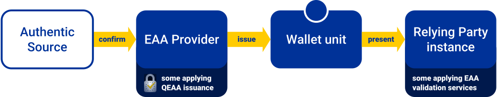

# QEAA documentation

This is part of the [QTSP documentation](../README.md).

## Reference model

## Architecture overview

- [Architecture overview for QEAA in WE BUILD](architecture.md)

## Feature definitions

Below is a non-exhaustive overview of QEAA features that use cases may choose to pilot.
For each feature in scope for the pilots, the QTSP group develops an interop profile and ensures available service compatibility.

- [QEAA issuance to EUDIW](issuance-to-eudiw.feature.md)
- [EAA validation at RP](validation.feature.md)
- [Verification of attributes](verification.feature.md)

## Schemes for QEAA

Participants of the QTSP group may issue QEAA under any of the schemes referenced below.

- Hello World Rulebook (planned): enables baseline interoperability testing

## Informative references

- Catalogues
  - [Attestation Rulebooks Catalog](https://github.com/eu-digital-identity-wallet/eudi-doc-attestation-rulebooks-catalog): Catalogue of schemes for EAA in EUDI

- Standards
  - [TS 119 471 v1.1.1](https://www.etsi.org/deliver/etsi_ts/119400_119499/119471/01.01.01_60/ts_119471v010101p.pdf): requirements for EAA Providers
  - [TS 119 472-1](https://docbox.etsi.org/esi/Open/Latest_Drafts/ETSI%20DRAFT%20TS_119_472-1v0.0.6-public.pdf): **DRAFT** Profiles for EAA - General requirements
  - [TS 119 472-2](https://portal.etsi.org/webapp/workProgram/Report_Schedule.asp?WKI_ID=63560): **DRAFT** Profiles for Relying Party Interface to EUDI Wallet
  - [TS 119 472-3](https://portal.etsi.org/webapp/workProgram/Report_Schedule.asp?WKI_ID=74915): **DRAFT** Protocol Profiles for interfacing to services providing Personal Identity Data and Electronic Attestation of Attributes
  - [TS 119 612](https://www.etsi.org/deliver/etsi_ts/119600_119699/119612/01.01.01_60/ts_119612v010101p.pdf): Policy and security requirements for trust service providers issuing electronic attestation of attributes (EAA)
  - [TS 119 602](https://www.etsi.org/deliver/etsi_ts/119600_119699/119602/01.01.01_60/ts_119602v010101p.pdf): Electronic signatures and infrastructures (ESI); Policy and security requirements for trust service providers issuing attribute attestations
  - [ETSI TS 119 478](https://docbox.etsi.org/esi/esi/70-Drafts/0019478/ESI-0019478v003.docx): **DRAFT** Protocol Interface for Trust Service Provider use of Authentic Sources 

- Technical reports
  - [TR 119 476 v1.2.1](https://www.etsi.org/deliver/etsi_tr/119400_119499/119476/01.02.01_60/tr_119476v010201p.pdf): SD and ZKP for EAA analysis
  - [TR 119 476-1 v1.3.1](https://www.etsi.org/deliver/etsi_tr/119400_119499/11947601/01.03.01_60/tr_11947601v010301p.pdf): SD and ZKP for EAA feasibility
  - [TR 119 479-2 v1.1.1](https://www.etsi.org/deliver/etsi_tr/119400_119499/11947902/01.01.01_60/tr_11947902v010101p.pdf): EAA extended validation
