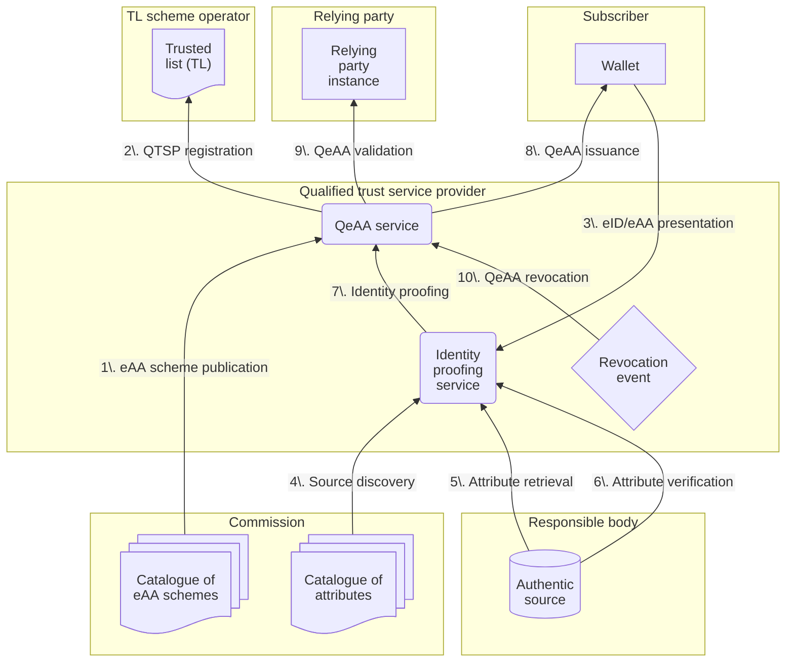
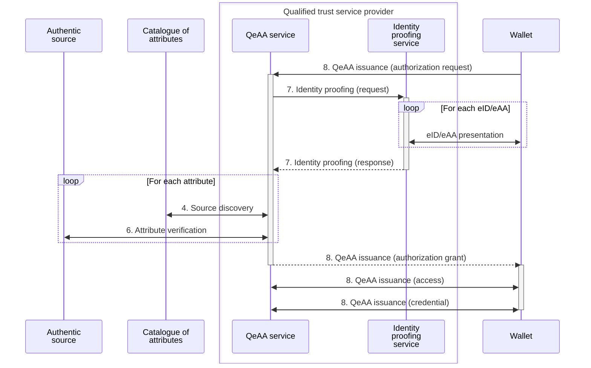
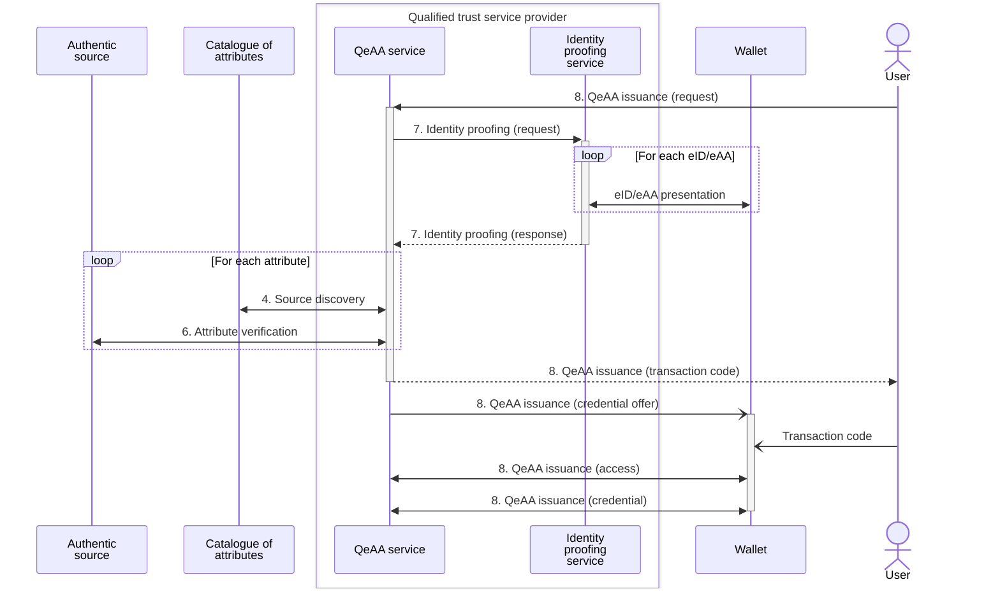

# Architecture overview for QeAA in WE BUILD

## Context

### Purpose of this document

This document specifies the high-level architecture for the issuance and validation of qualified electronic attestations of attributes (QeAA) within WE BUILD.
It aims to guide the specification, development, testing and implementation of QeAA.
It complements the [WE BUILD architecture documentation](https://github.com/webuild-consortium/architecture) which specifies, among other topics, the issuance and validation of attestations within WE BUILD in general.

### Definitions

In WE BUILD, QTSPs as defined under [eIDAS](https://eur-lex.europa.eu/legal-content/EN/TXT/?uri=CELEX%3A02014R0910-20241018) Art. 3(20) provide pre-production eAA issuance and validation services as defined under Art. 3(16)(g) and (h), technically ready to be audited for qualification as defined under Art. 3(17), for QeAA as defined under Art. 3(45).

## Technical specifications for QeAA

### QeAA functional decomposition

The following decomposition is inspired by [ETSI TS 119 471 v1.1.1](https://www.etsi.org/deliver/etsi_ts/119400_119499/119471/01.01.01_60/ts_119471v010101p.pdf).

- **QeAA service:** An electronic service which supports the following QeAA processes, governed under an *eAA scheme*. It is provided by a QTSP which is on the *trusted list* upon auditing for conformance to general requirements and to specific *eAA schemes* and upon qualification for QeAA issuance.
    - **QeAA issuance:** The *QTSP* issues a QeAA upon the request of a *subscriber* into their *wallet*.
    - **QeAA usage:** The *subscriber* uses the QeAA in accordance to the service terms and conditions.
    - **QeAA renewal:** The *QTSP* issues a new QeAA with the same attribute values as the previous QeAA.
    - **QeAA revocation:** The *QTSP* revokes a QeAA upon a trigger *revocation event*, such as an authorised request by a subject or subscriber.
    - **QeAA validation:** The *relying party* uses a *relying party instance* to verify and confirm that a QeAA is valid, typically under mutual authentication with its containing *wallet*.
- **Identity proofing service:** An electronic service by which the identity and additional attributes of an applying *subscriber* are verified. The verification process uses evidence attesting to the required identity attributes, including evidence from *PID/eAA presentation*, *attribute retrieval*, and *attribute verification*. To discover authentic sources, the QTSP may consult the *catalogue of attributes*.

### Deployment model and interfaces

### Data flows and interactions

#### Protocol profiles

The interfaces listed below are those from the [Deployment model and interfaces](#deployment-model-and-interfaces).
Each protocol ideally is specified in a [WE BUILD Conformance Specification](https://github.com/webuild-consortium/wp4-architecture) (WBCS).
This way, interoperability can be tested on the [Interoperability Test Bed](https://github.com/webuild-consortium/wp4-interop-test-bed).
Some interfaces do not have common protocols since these are considered to be internal implementation details where WE BUILD does not require interoperability.

|Interface|Protocol|QTSP role|
|--|--|--|
|1\. eAA scheme publication|||
|2\. QTSP registration     |||
|3\. eID/eAA presentation  |[WBCS 2: Credential Presentation](https://github.com/webuild-consortium/wp4-architecture/blob/main/conformance-specs/cs-02-credential-presentation.md)|Verifier|
|4\. Source discovery      |||
|5\. Attribute retrieval   |||
|6\. Attribute verification|||
|7\. Identity proofing     |N/A|N/A|
|8\. QeAA issuance         |[WBCS 1: Credential Issuance](https://github.com/webuild-consortium/architecture/blob/main/conformance-specs/cs-01-credential-issuance.md)|Attestation Provider (Issuer)|
|9\. QeAA validation       |||
|10\. QeAA revocation      |N/A|N/A|

### Example use case scenarios

#### [QEAA issuance to EUDIW, Wallet-initiated](./issuance-to-eudiw.feature.md#scenario-wallet-initiated)

#### [QEAA issuance to EUDIW, Issuer-initiated](./issuance-to-eudiw.feature.md#scenario-issuer-initiated) with a pre-authorised code

## Deviations from European Digital Identity

In the WE BUILD pre-production environment, some European Digital Identity framework roles are simulated:

|Role|WE BUILD group|
|--|--|
|Commission||
|TL scheme operator|WP4 Trust Registry Infrastructure|
