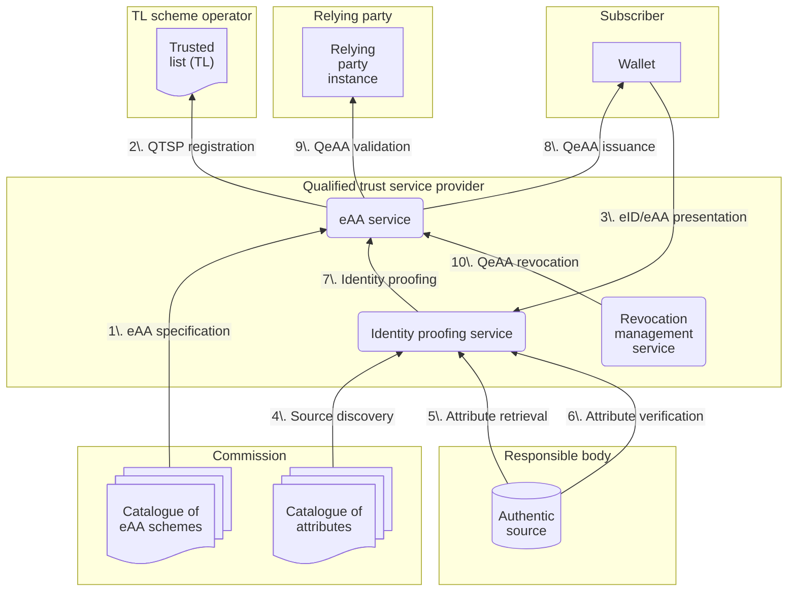

# Architecture overview for QeAA in WE BUILD

## Context

### Purpose of this document

This document specifies the high-level architecture for the issuance and validation of qualified electronic attestations of attributes (QeAA) within WE BUILD.
It aims to guide the specification, development, testing and implementation of QeAA.
It complements the [WE BUILD architecture documentation](https://github.com/webuild-consortium/architecture) which specifies, among other topics, the issuance and validation of attestations within WE BUILD in general.

### Definitions

In WE BUILD, QTSPs as defined under [eIDAS](https://eur-lex.europa.eu/legal-content/EN/TXT/?uri=CELEX%3A02014R0910-20241018) Art. 3(20) provide pre-production eAA issuance and validation services as defined under Art. 3(16)(g) and (h), technically ready to be audited for qualification as defined under Art. 3(17), for QeAA as defined under Art. 3(45).

## Technical specifications for QeAA in WE BUILD

### Deployment model and interfaces

### Data flows and interactions

#### Protocol profiles

|Interface|Protocol|QTSP role|
|--|--|--|
|1\. eAA specification     |||
|2\. QTSP registration     |||
|3\. eID/eAA presentation  |[WBCS 2: Credential Presentation](https://github.com/webuild-consortium/wp4-architecture/blob/main/conformance-specs/cs-02-credential-presentation.md)|Verifier|
|4\. Source discovery      |||
|5\. Attribute retrieval   |||
|6\. Attribute verification|||
|7\. Identity proofing     |||
|8\. QeAA issuance         |[WBCS 1: Credential Issuance](https://github.com/webuild-consortium/architecture/blob/main/conformance-specs/cs-01-credential-issuance.md)|Attestation Provider (Issuer)|
|9\. QeAA validation       |||
|10\. QeAA revocation      |||
