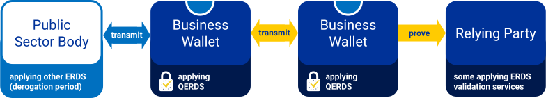

# QERDS documentation

This is documentation of the [WE BUILD: WP4 QTSP group](../README.md).

Scope:

- Provision of electronic registered delivery services

## Reference model

## Architecture overview

- [Architecture overview for QERDS in WE BUILD](architecture.md)

## Feature definitions

Below is a non-exhaustive overview of QERDS features that use cases may choose to pilot.
For each feature in scope for the pilots, the QTSP group develops an interop profile and ensures available service compatibility.

- [QERDS between wallets](between-wallets.feature.md)

## Technical reports

- [QERDS interoperability framework requirements](interop-framework.md)

## Informative references

None yet.
