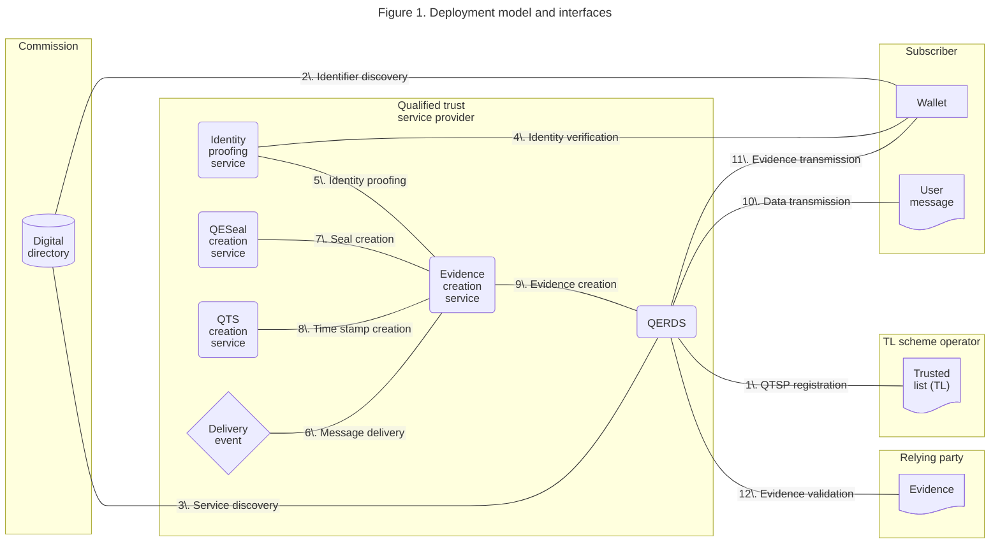
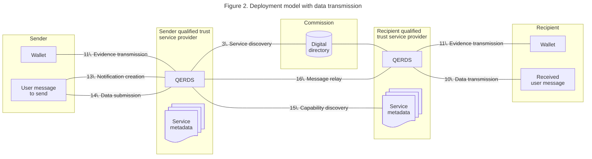

# Architecture overview for QERDS in WE BUILD

## Context

### Purpose of this document

This document specifies the high-level architecture for the [provision of qualified electronic registered delivery services (QERDS)](README.md) within WE BUILD.
It aims to guide the specification, development, testing and implementation of QERDS.
It complements the [WE BUILD architecture documentation](https://github.com/webuild-consortium/wp4-architecture) which specifies, among other topics, the transmission of data within WE BUILD in general.

### Definitions

In WE BUILD, QTSPs as defined under [eIDAS] Art. 3(20) provide pre-production ERDS as defined under Art. 3(16)(g) and (h), technically ready to be audited for qualification as defined under Art. 3(17), for QERDS as defined under Art. 3(37).
The remainder of this specification uses the QERDS term for the pre-production WE BUILD definition.

[eIDAS]: https://eur-lex.europa.eu/legal-content/EN/TXT/?uri=CELEX%3A02014R0910-20241018

## Technical specifications for QERDS

### Functional decomposition

The following decomposition is inspired by [ETSI EN 319 521 v1.1.1], [ETSI EN 319 522-1 v1.2.1](https://www.etsi.org/deliver/etsi_en/319500_319599/31952201/01.02.01_60/en_31952201v010201p.pdf), and [ETSI TS 119 471 v1.1.1](https://www.etsi.org/deliver/etsi_ts/119400_119499/119471/01.01.01_60/ts_119471v010101p.pdf).

[ETSI EN 319 521 v1.1.1]: https://www.etsi.org/deliver/etsi_en/319500_319599/319521/01.01.01_60/en_319521v010101p.pdf

The primary function is provided by:

- **QERDS:** An electronic service which implements the following processes. It is provided by a QTSP which is on the *trusted list* upon auditing for conformance to general requirements and to specific EBW interoperability requirements and upon qualification for QEAA issuance.
    - **Message submission:** The *sender* uses the *QTSP* to submit a document or notification to a *wallet*, with protection against the risk of loss, theft, damage or any unauthorised alterations.
    - **Message retrieval:** The *recipient* uses the *QTSP* to retrieve a document or notification in their *wallet*.
    - **Evidence retrieval:** The *QTSP* provides timestamped, sealed evidence to the *wallet* of the *sender* or *recipient* about the transmission, including proof of sending and receiving the data.
    - **Message relay:** The *QTSP* relays messages from another ERDS, potentially a gateway during the European Business Wallet derogation period.
    - **Common service access:** The *QTSP* accesses message routing, trust management, capability management, and governance functions from common services such as the *European Digital Directory*.

This function depends on the following functions implemented by the QERDS provider, relying on internal services or on an external supplier:

- **Identity proofing service:** an electronic service by which the identity and additional attributes of an applying *subscriber* are verified. The verification process uses evidence attesting to the required identity attributes, including evidence from *PID/EAA presentation*.
- **Qualified electronic seal creation service (QESeal creation service):** an electronic service by which the *QTSP* attaches or logically associates with data an qualified electronic seal to ensure the data’s origin and integrity.
- **Qualified time stamp creation service (QTS creation service):** an electronic service by which the *QTSP* binds data to a particular time establishing evidence that the latter data existed at that time.

### Policy and security requirements

#### QERDS

The requirements from [(EU) 2025/1944](https://data.europa.eu/eli/reg_impl/2025/1944/oj) Annex apply, based on [ETSI EN 319 521 v1.1.1].

#### Identity proofing service

The requirements from [eIDAS] Art. 24(1a) and [ETSI TS 119 461 v2.1.1](https://www.etsi.org/deliver/etsi_ts/119400_119499/119461/02.01.01_60/ts_119461v020101p.pdf) apply.

#### QESeal creation service

The requirements from [eIDAS] Art. 35, Art. 38, Annex III, [ETSI EN 319 411-2 V2.6.1](https://www.etsi.org/deliver/etsi_en/319400_319499/31941102/02.06.01_60/en_31941102v020601p.pdf), [ETSI EN 319 401 V3.1.1](https://www.etsi.org/deliver/etsi_en/319400_319499/319401/03.01.01_60/en_319401v030101p.pdf) and [ETSI TS 119 431-1 V1.3.1](https://www.etsi.org/deliver/etsi_ts/119400_119499/11943101/01.03.01_60/ts_11943101v010301p.pdf) apply.

#### QTS creation service

The requirements from [eIDAS] Art. 42 apply.

### Deployment model and interfaces

The visualisations below represents a value chain, in which the primary data flows from left to right. The technical control flow may be reverse, for example using service request-response patterns.





> [!NOTE]
> The sender either submits data or creates a notification.
> The recipient receives notifications and possibly handed over data, matching the submitted data.
> The sender also receives notifications in the same way that the recipient receives notifications, containing evidence of the transmission.
> The evidence is stored in the business wallet of either, while the handed over data can be made available through any application programming interface or user interface to the wallet owner.

> [!NOTE]
> The QERDS can be technically implemented using either or both of:
>
> - provider access point, shared among multiple QERDS subscribers, with end-to-end encryption between providers;
> - subscriber access point, controlled by a single QERDS subscriber using their wallet, with end-to-end encryption between sender and recipient.
>
> The provider access point is required at least for interface 11. Evidence transmission, since the provider creates the QERDS evidence.
>
> Using a provider access point for user messages enables intermediary processing by the QERDS provider.
> This enables use cases such as conversion between legacy and new data formats, conversion for cross-border data compatibility, and automated business reporting.
> This does not prevent the recipient from relying on the qualified electronic signatures or seals on any notifications or submitted data, if these are created by the sender, for example using the sender’s business wallet.
>
> Using a subscriber access point does not preclude such intermediary processing, but requires different interaction patterns.
> For example, the subscriber may need to access the intermediary service provider by other means, such as the provider’s business wallet through the QERDS.
>
> The WE BUILD work should result in evidence of pros and cons with regard to either technical implementation.

### Data flows and interactions

#### Protocol profiles

*Table 1. Protocol profiles and QTSP roles*

|Interface|Protocol|QTSP role|
|--|--|--|
|1\. QTSP registration|||
|2\. Identifier discovery|||
|3\. Service discovery|||
|4\. Identity verification|[WBCS 2: Credential Presentation](https://github.com/webuild-consortium/wp4-architecture/blob/main/conformance-specs/cs-02-credential-presentation.md)|Verifier|
|5\. Identity proofing|N/A|N/A|
|6\. Message delivery|N/A|N/A|
|7\. Seal creation|||
|8\. Time stamp creation|||
|9\. Evidence creation|N/A|N/A|
|10\. Data transmission|||
|11\. Evidence transmission|||
|12\. Evidence validation|||
|13\. Notification creation|||
|14\. Data submission|||
|15\. Capability discovery|||
|16\. Message relay|||

> [!NOTE]
> For considerations regarding interface 16. Message relay, see the technical report on the [QERDS interoperability framework](interop-framework.md).

### Example use case scenarios
The following sequence diagram reflects an example use case of a user as the sender and a receiver EBW. It basically refines previous figures into a time-ordered interaction view and aligns it with the interfaces and considerations.

```mermaid
sequenceDiagram
    actor User as User
    participant Sender as Sender's EBW
    box Sender's Qualified trust service provider
        participant S_QTSP as Sender's QERDS<br>service
        participant S_IPS as Sender's Identity<br>proofing<br>service
        participant S_QES as Sender's QESeal<br>service 
        participant S_QTS as Sender's QTS<br>service 
        participant S_ECS as Sender's Evidence<br>service 
    end
    participant DD as European Digital Directory
    box Receiver's Qualified trust service provider
        participant R_QTSP as Receiver's QERDS<br>service
    end
    participant Receiver as Receiver's EBW

    User->>+Sender: Request to send<br>document
    Sender->>+S_QTSP: 1a. Request to send<br>(identification context)
    S_QTSP->>+S_IPS: 1b. Identity verification<br>of sender (4)
    S_IPS->>Sender: Request identity<br>verification of sender
    Sender->>User: Request identity<br>verification 
    Sender->>S_IPS: Identity<br>verification data 
    S_IPS->>S_ECS: Identity proofing<br>result (5)
    S_IPS-->>-S_QTSP: Verified
    Sender->>S_QTSP: 2. Document / notification<br>(13, 14. Notification creation,<br>Data submission)
    deactivate Sender
    S_QTSP->>+S_ECS: Create evidence<br>(delivery event 6)
    S_ECS->>+S_QES: Seal creation (7)
    S_QES-->>-S_ECS: Seal
    S_ECS->>+S_QTS: Time stamp<br>creation (8)
    S_QTS-->>-S_ECS: Time stamp
    S_ECS-->>-S_QTSP: Evidence (9)
    S_QTSP->>+Sender: Evidence of document<br>sent (11. Evidence transmission)

    S_QTSP->>+DD: 3. Service / identifier discovery<br>(2, 3. Identifier and service discovery)
    DD-->>-S_QTSP: Receiver EBW<br>capabilities, endpoints
    S_QTSP->>+R_QTSP: 4. Handshake / capability<br>check (15. Capability discovery)
    S_QTSP->>R_QTSP: 5. Message relay<br>(16. Message relay)
    note over R_QTSP,Receiver: ref: Receiver flow detailed in the following diagram
    R_QTSP->>S_QTSP: 9. Notify successful<br>consignment and handover
    deactivate R_QTSP
    S_QTSP->>+Sender: Evidence of successful<br>consignment 
    deactivate Sender
    deactivate S_QTSP
## Deviations from European Business Wallets

In the WE BUILD pre-production environment, some European Business Wallet roles are simulated:

*Table 2. Role deviations within WE BUILD*

|Role|WE BUILD group|
|--|--|
|Commission|WP4 Trust Registry Infrastructure|
|TL scheme operator|WP4 Trust Registry Infrastructure|
